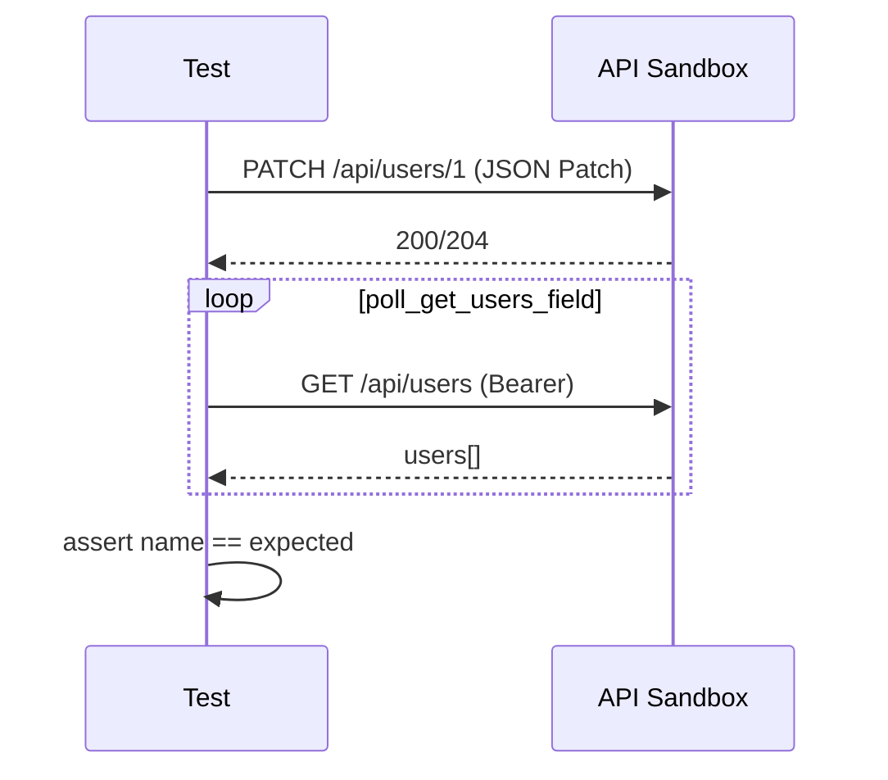

# API Tests — JSON Patch, Rules Client, and Read-After-Write

**Source file:** [`../../../../tests/api/test_rules_api.py`](../../../../tests/api/test_rules_api.py)

---

## Purpose

This is the **most advanced** API module in testflow-pytest. It exercises:

- **RFC 6902 JSON Patch** utilities (`JsonPatchBuilder`, `modify_patch_field`)
- **`patch_user_via_rules`** client with `Content-Type: application/json-patch+json`
- **Read-after-write** flow with retry (`execute_successful_patch_flow`)
- Mandatory field validation via parametrization
- Bearer authentication and OAuth-style service credentials
- Valid/invalid payloads loaded from JSON fixtures
- Response mutation in the UI (simulated empty list)

Prepares students for partial REST APIs (PATCH), error contracts, and eventual consistency.

---

## Prerequisites

| Item | Description |
|------|-------------|
| API | `PATCH /api/users/{id}`, `GET /api/users` |
| Auth | `auth_token` fixture (session, cached in `conftest.py`) |
| JSON fixtures | `api/patch-payloads.json` |
| Factories | `UserPatchFactory` |
| Constants | `EXPECT` (HTTP status), `TC` (case IDs) |

```bash
pytest tests/api/test_rules_api.py -v
pytest tests/api/test_rules_api.py -m critical
pytest tests/api/test_rules_api.py -k "JsonPatch"
```

---

## Markers used

| Marker | Application |
|--------|-------------|
| `api` | All classes |
| `regression` | All classes |
| `critical` | `test_patches_user_and_validates_read_after_write_with_retry` |
| `smoke` | `test_api_with_auth_returns_users_with_bearer_token` |

---

## Structure overview

```
test_rules_api.py
├── imports
├── constants: PATCH_PAYLOADS, VALID_PATCH_CASES, INVALID_PATCH_CASES
├── TestJsonPatchUtilities
├── TestPatchVsTryPatch
├── TestExecuteSuccessfulPatchFlow
├── TestMandatoryFieldValidation
├── TestDualServiceReadAfterWrite
├── TestAuthenticatedApiRequest
├── TestOAuthStyleServiceToken
├── TestInterceptWithResponseMutation
└── TestPatchPayloadFixtures
```

---

## Imports — block by block

### `import json`

Manual body serialization in `route.fulfill(body=json.dumps(body))` for mutation test.

---

### `import time`

Generates unique name with timestamp in `execute_successful_patch_flow` to avoid collision between runs.

---

### `import pytest`

Parametrize, markers, fixtures.

---

### `from playwright.sync_api import APIRequestContext, Page, expect`

HTTP API + page for intercept with JSON mutation.

---

### `from support.api.rules_client import (...)`

| Symbol | Function |
|--------|----------|
| `SERVICE_CREDENTIALS` | Dict `client_id` / `client_secret` |
| `execute_successful_patch_flow` | PATCH + poll GET until expected field |
| `get_users_via_profile` | Authenticated GET `/api/users` |
| `patch_user_via_rules` | PATCH with JSON Patch content-type |

---

### `from support.auth import fetch_auth_token, visit_authenticated`

- `fetch_auth_token`: POST login → dict with token
- `visit_authenticated`: browser session

---

### `from support.config import BASE_URL, DEMO_EMAIL, DEMO_PASSWORD`

Environment and demo credentials.

---

### `from support.constants.http_status import EXPECT`

Object with named HTTP codes (`EXPECT.happy`, `EXPECT.no_content`, etc.) — readable assertions tolerant to sandbox variations.

---

### `from support.constants.test_cases import TC`

ID `TC.API_PATCH_READ_AFTER_WRITE` (`TC-0301`) referenced in critical test docstring.

---

### `from support.factories.user_patch import UserPatchFactory`

Factory to build patch operation lists (`create_name_patch`, `create_simple_name_patch`).

---

### `from support.helpers import validate_schema`

User structure validation on GET.

---

### `from support.helpers.fixtures import read_fixture`

Loads `api/patch-payloads.json` at module import.

---

### `from support.utilities.json_patch import JsonPatchBuilder, modify_patch_field`

| Utility | Role |
|---------|------|
| `JsonPatchBuilder` | Fluent API for `replace` ops |
| `modify_patch_field` | Clones patch and changes a `path` — negative tests |

---

## Module constants

```python
PATCH_PAYLOADS = read_fixture("api/patch-payloads.json")
VALID_PATCH_CASES = PATCH_PAYLOADS["validNamePatches"]
INVALID_PATCH_CASES = PATCH_PAYLOADS["invalidPatches"]
```

**Eager** loading (on import): files read once per PyTest session.

- **`VALID_PATCH_CASES`**: parametrized cases that should be accepted or fail gracefully
- **`INVALID_PATCH_CASES`**: cases that should return 4xx/5xx

---

## Class `TestJsonPatchUtilities`

**Unit** tests for helpers — no HTTP.

---

### `test_builds_rfc_6902_patch_operations`

```python
def test_builds_rfc_6902_patch_operations(self) -> None:
    patches = JsonPatchBuilder().replace("/name", "Alex").replace("/role", "admin").build()
    assert len(patches) == 2
    assert patches[0] == {"op": "replace", "path": "/name", "value": "Alex"}
```

| Phase | Description |
|-------|-------------|
| **Given** | Empty builder |
| **When** | Two chained `replace` operations |
| **Then** | RFC 6902 list with op, path, value |

**RFC 6902:** IETF standard for JSON diff — common ops: `add`, `remove`, `replace`, `move`, `copy`, `test`.

---

### `test_modifies_patch_field_for_negative_tests`

```python
def test_modifies_patch_field_for_negative_tests(self) -> None:
    base = UserPatchFactory.create_name_patch("A", "B", "C")
    invalid = modify_patch_field(base, "/name", None)
    name_op = next(op for op in invalid if op["path"] == "/name")
    assert name_op["value"] is None
```

**When:** replaces value at `/name` with `None`.

**Then:** corresponding patch operation has `value is None` — simulates mandatory field violation without mutating original fixture.

---

## Class `TestPatchVsTryPatch`

Compares real PATCH behavior via rules client.

---

### `test_patch_user_via_rules_accepts_json_patch_content_type`

```python
def test_patch_user_via_rules_accepts_json_patch_content_type(
    self, api_request: APIRequestContext, auth_token: str
) -> None:
    patches = UserPatchFactory.create_name_patch("Patch", "Test", "User")
    response = patch_user_via_rules(api_request, auth_token, 1, patches)
    assert response.status in (
        EXPECT.happy,
        EXPECT.no_content,
        EXPECT.not_found,
        EXPECT.bad_request,
    )
```

**When:** PATCH user id `1` with Bearer token.

**Then:** status in tolerant set — sandbox may vary (200, 204, 404, 400) per user state.

**HTTP concept:** `Content-Type: application/json-patch+json` distinguishes JSON Patch from merge patch (`application/merge-patch+json`).

---

### `test_try_patch_rejects_invalid_patch`

```python
def test_try_patch_rejects_invalid_patch(self, api_request: APIRequestContext, auth_token: str) -> None:
    response = patch_user_via_rules(
        api_request,
        auth_token,
        999,
        [{"op": "replace", "path": "/invalid", "value": None}],
    )
    assert response.status in (400, 404, 422, 500)
```

Non-existent user (`999`) + invalid path → expected error.

---

## Class `TestExecuteSuccessfulPatchFlow`

---

### `test_patches_user_and_validates_read_after_write_with_retry`

```python
@pytest.mark.critical
def test_patches_user_and_validates_read_after_write_with_retry(
    self, api_request: APIRequestContext, auth_token: str
) -> None:
    """tc(TC.API_PATCH_READ_AFTER_WRITE, 'patches user and validates read-after-write with retry')"""
    unique_name = f"PatchFlow {int(time.time() * 1000)}"
    patches = UserPatchFactory.create_simple_name_patch(unique_name)
    execute_successful_patch_flow(api_request, auth_token, 1, patches, "name")
```

| Phase | Description |
|-------|-------------|
| **Given** | Valid token, unique name by timestamp |
| **When** | `execute_successful_patch_flow` PATCHes and polls GET |
| **Then** | Read `name` field matches patched value (inside helper) |

**Read-after-write:** after write, confirm read — detects replication lag or cache.

**Docstring:** reference to case ID `TC-0301` for Zephyr/Jira traceability.

---

## Class `TestMandatoryFieldValidation`

Parametrization for mandatory fields.

```python
@pytest.mark.parametrize(
    "path,case_id",
    [
        ("/name", "TC-4001"),
    ],
    ids=["rejects null at /name"],
)
def test_rejects_null_at_mandatory_field(
    self,
    api_request: APIRequestContext,
    auth_token: str,
    path: str,
    case_id: str,
) -> None:
    base_patch = UserPatchFactory.create_simple_name_patch("Valid Name")
    modified = modify_patch_field(base_patch, path, None)
    response = patch_user_via_rules(api_request, auth_token, 1, modified)
    assert response.status in (400, 404, 422, 500)
```

| Parameter | Usage |
|-----------|-------|
| `path` | Target JSON Patch field |
| `case_id` | External ID (`TC-4001`) — available for future reporting |

**When:** sends `null` on mandatory field.

**Then:** 4xx/5xx error.

---

## Class `TestDualServiceReadAfterWrite`

---

### `test_validates_get_users_after_auth_token_seed`

```python
def test_validates_get_users_after_auth_token_seed(
    self, api_request: APIRequestContext, auth_token: str
) -> None:
    response = get_users_via_profile(api_request, auth_token)
    assert response.status == 200
    body = response.json()
    assert isinstance(body["users"], list)
    assert len(body["users"]) > 0
    validate_schema(body["users"][0], {"name": "string", "email": "string", "role": "string"})
```

**Auth + profile API integration:** session fixture token works on GET users; first user respects schema.

---

## Class `TestAuthenticatedApiRequest`

---

### `test_api_with_auth_returns_users_with_bearer_token`

```python
@pytest.mark.smoke
def test_api_with_auth_returns_users_with_bearer_token(
    self, api_request: APIRequestContext, auth_token: str
) -> None:
    response = get_users_via_profile(api_request, auth_token)
    assert response.status == 200
    assert isinstance(response.json()["users"], list)
```

Simplified smoke — status and list type only (no detailed schema).

---

## Class `TestOAuthStyleServiceToken`

---

### `test_fetch_auth_token_returns_non_empty_token`

```python
def test_fetch_auth_token_returns_non_empty_token(self, api_request: APIRequestContext) -> None:
    session = fetch_auth_token(api_request, DEMO_EMAIL, DEMO_PASSWORD)
    assert isinstance(session["token"], str)
    assert session["token"]
```

Validates direct login helper (parallel to `auth_token` fixture).

---

### `test_service_credentials_returns_client_credentials_object`

```python
def test_service_credentials_returns_client_credentials_object(self) -> None:
    assert set(SERVICE_CREDENTIALS.keys()) == {"client_id", "client_secret"}
    assert SERVICE_CREDENTIALS["client_id"]
    assert SERVICE_CREDENTIALS["client_secret"]
```

Configuration test — non-empty service credentials (OAuth2 client credentials pattern).

---

## Class `TestInterceptWithResponseMutation`

Unlike static `fulfill`: **fetches real response**, alters JSON, returns to browser.

---

### `test_mutates_users_response_to_simulate_empty_list`

```python
def test_mutates_users_response_to_simulate_empty_list(self, page: Page, api_request) -> None:
    def mutate_users(route) -> None:
        response = route.fetch()
        body = response.json()
        body["users"] = []
        body["total"] = 0
        route.fulfill(
            status=response.status,
            content_type="application/json",
            body=json.dumps(body),
        )

    page.route("**/api/users", mutate_users)
    visit_authenticated(page, api_request, "/web/activity.html")
    with page.expect_response("**/api/users"):
        page.get_by_test_id("fetch-users-btn").click()
    expect(page.get_by_test_id("api-result")).to_contain_text("Fetched 0 users")
```

| Step | Detail |
|------|--------|
| `route.fetch()` | Executes real request to backend |
| Mutation | Zeros `users` and `total` |
| `fulfill` | Delivers altered body to page |
| UI | Should reflect zero users |

**vs full stub:** preserves original headers/status — test closer to proxy that filters data.

---

## Class `TestPatchPayloadFixtures`

Data-driven parametrization from JSON.

---

### `test_valid_patch_payloads_from_fixture`

```python
@pytest.mark.parametrize("case", VALID_PATCH_CASES, ids=lambda c: c["label"])
def test_valid_patch_payloads_from_fixture(
    self,
    api_request: APIRequestContext,
    auth_token: str,
    case: dict,
) -> None:
    response = patch_user_via_rules(api_request, auth_token, 1, case["patches"])
    assert response.status in (
        EXPECT.happy,
        EXPECT.no_content,
        EXPECT.not_found,
        EXPECT.bad_request,
    )
```

Each entry in `validNamePatches` becomes a test with id = `case["label"]`.

---

### `test_invalid_patch_payloads_from_fixture`

```python
@pytest.mark.parametrize("case", INVALID_PATCH_CASES, ids=lambda c: c["label"])
def test_invalid_patch_payloads_from_fixture(
    self,
    api_request: APIRequestContext,
    auth_token: str,
    case: dict,
) -> None:
    user_id = case.get("userId", 1)
    response = patch_user_via_rules(api_request, auth_token, user_id, case["patches"])
    assert response.status in (400, 404, 422, 500)
```

Supports custom `userId` per invalid case (default `1`).

---

## Global fixture: `auth_token`

Defined in `conftest.py`:

```python
@pytest.fixture(scope="session")
def auth_token(cache_auth_token: str) -> str:
    return cache_auth_token
```

Token obtained once per test session — all authenticated PATCH/GET reuse it.

---

## Diagram — read-after-write flow



---

## Consolidated concepts

### JSON Patch vs PUT

- PATCH applies partial diff; PUT replaces entire resource.
- List of ops is the body — not a complete user object.

### Tolerant assertions with EXPECT

Sandboxes and demo environments vary status; `in (...)` sets avoid false negatives while still ensuring "no silent success on error".

### Parametrize with JSON fixtures

Separates **test data** (JSON) from **logic** (Python) — analysts can expand cases without changing code.

---

## Learning checklist

- [ ] Build manual patch with `JsonPatchBuilder`
- [ ] Explain `application/json-patch+json`
- [ ] Describe difference between `fulfill(json=...)` and fetch + mutate + fulfill
- [ ] Read structure of `api/patch-payloads.json`
- [ ] Run `critical` test in isolation and interpret internal retry
- [ ] Relate `TC.API_PATCH_READ_AFTER_WRITE` to test docstring
