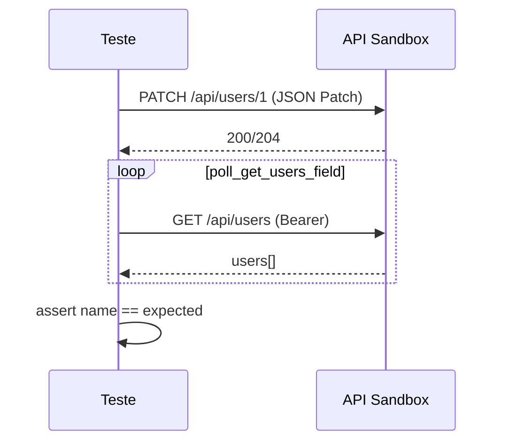

# Testes de API — JSON Patch, Rules Client e Read-After-Write

**Arquivo-fonte:** [`../../../../tests/api/test_rules_api.py`](../../../../tests/api/test_rules_api.py)

---

## Propósito

Este é o módulo de API **mais avançado** do testflow-pytest. Exercita:

- Utilitários **RFC 6902 JSON Patch** (`JsonPatchBuilder`, `modify_patch_field`)
- Cliente **`patch_user_via_rules`** com `Content-Type: application/json-patch+json`
- Fluxo **read-after-write** com retry (`execute_successful_patch_flow`)
- Validação de campos obrigatórios via parametrização
- Autenticação Bearer e credenciais de serviço OAuth-style
- Payloads válidos/inválidos carregados de fixture JSON
- Mutação de response na UI (lista vazia simulada)

Prepara estudantes para APIs REST parciais (PATCH), contratos de erro e consistência eventual.

---

## Pré-requisitos

| Item | Descrição |
|------|-----------|
| API | `PATCH /api/users/{id}`, `GET /api/users` |
| Auth | Fixture `auth_token` (sessão, cache em `conftest.py`) |
| Fixtures JSON | `api/patch-payloads.json` |
| Factories | `UserPatchFactory` |
| Constantes | `EXPECT` (HTTP status), `TC` (case IDs) |

```bash
pytest tests/api/test_rules_api.py -v
pytest tests/api/test_rules_api.py -m critical
pytest tests/api/test_rules_api.py -k "JsonPatch"
```

---

## Markers utilizados

| Marker | Aplicação |
|--------|-----------|
| `api` | Todas as classes |
| `regression` | Todas as classes |
| `critical` | `test_patches_user_and_validates_read_after_write_with_retry` |
| `smoke` | `test_api_with_auth_returns_users_with_bearer_token` |

---

## Visão geral da estrutura

```
test_rules_api.py
├── imports
├── constantes: PATCH_PAYLOADS, VALID_PATCH_CASES, INVALID_PATCH_CASES
├── TestJsonPatchUtilities
├── TestPatchVsTryPatch
├── TestExecuteSuccessfulPatchFlow
├── TestMandatoryFieldValidation
├── TestDualServiceReadAfterWrite
├── TestAuthenticatedApiRequest
├── TestOAuthStyleServiceToken
├── TestInterceptWithResponseMutation
└── TestPatchPayloadFixtures
```

---

## Imports — bloco a bloco

### `import json`

Serialização manual do body em `route.fulfill(body=json.dumps(body))` no teste de mutação.

---

### `import time`

Gera nome único com timestamp em `execute_successful_patch_flow` para evitar colisão entre runs.

---

### `import pytest`

Parametrize, markers, fixtures.

---

### `from playwright.sync_api import APIRequestContext, Page, expect`

API HTTP + página para intercept com mutação de JSON.

---

### `from support.api.rules_client import (...)`

| Símbolo | Função |
|---------|--------|
| `SERVICE_CREDENTIALS` | Dict `client_id` / `client_secret` |
| `execute_successful_patch_flow` | PATCH + poll GET até campo esperado |
| `get_users_via_profile` | GET `/api/users` autenticado |
| `patch_user_via_rules` | PATCH com content-type JSON Patch |

---

### `from support.auth import fetch_auth_token, visit_authenticated`

- `fetch_auth_token`: POST login → dict com token
- `visit_authenticated`: sessão no browser

---

### `from support.config import BASE_URL, DEMO_EMAIL, DEMO_PASSWORD`

Ambiente e credenciais demo.

---

### `from support.constants.http_status import EXPECT`

Objeto com códigos HTTP nomeados (`EXPECT.happy`, `EXPECT.no_content`, etc.) — asserções legíveis e tolerantes a variações do sandbox.

---

### `from support.constants.test_cases import TC`

ID `TC.API_PATCH_READ_AFTER_WRITE` (`TC-0301`) referenciado na docstring do teste crítico.

---

### `from support.factories.user_patch import UserPatchFactory`

Factory para montar listas de operações patch (`create_name_patch`, `create_simple_name_patch`).

---

### `from support.helpers import validate_schema`

Validação de estrutura de user no GET.

---

### `from support.helpers.fixtures import read_fixture`

Carrega `api/patch-payloads.json` no import do módulo.

---

### `from support.utilities.json_patch import JsonPatchBuilder, modify_patch_field`

| Utilitário | Papel |
|------------|-------|
| `JsonPatchBuilder` | API fluente para ops `replace` |
| `modify_patch_field` | Clona patch e altera um `path` — testes negativos |

---

## Constantes de módulo

```python
PATCH_PAYLOADS = read_fixture("api/patch-payloads.json")
VALID_PATCH_CASES = PATCH_PAYLOADS["validNamePatches"]
INVALID_PATCH_CASES = PATCH_PAYLOADS["invalidPatches"]
```

Carregamento **eager** (no import): arquivos lidos uma vez por sessão PyTest.

- **`VALID_PATCH_CASES`**: casos parametrizados que devem ser aceitos ou falhar graciosamente
- **`INVALID_PATCH_CASES`**: casos que devem retornar 4xx/5xx

---

## Classe `TestJsonPatchUtilities`

Testes **unitários** de helpers — sem HTTP.

---

### `test_builds_rfc_6902_patch_operations`

```python
def test_builds_rfc_6902_patch_operations(self) -> None:
    patches = JsonPatchBuilder().replace("/name", "Alex").replace("/role", "admin").build()
    assert len(patches) == 2
    assert patches[0] == {"op": "replace", "path": "/name", "value": "Alex"}
```

| Fase | Descrição |
|------|-----------|
| **Given** | Builder vazio |
| **When** | Duas operações `replace` encadeadas |
| **Then** | Lista RFC 6902 com op, path, value |

**RFC 6902:** padrão IETF para diff JSON — ops comuns: `add`, `remove`, `replace`, `move`, `copy`, `test`.

---

### `test_modifies_patch_field_for_negative_tests`

```python
def test_modifies_patch_field_for_negative_tests(self) -> None:
    base = UserPatchFactory.create_name_patch("A", "B", "C")
    invalid = modify_patch_field(base, "/name", None)
    name_op = next(op for op in invalid if op["path"] == "/name")
    assert name_op["value"] is None
```

**When:** substitui valor em `/name` por `None`.

**Then:** operação patch correspondente tem `value is None` — simula violação de campo obrigatório sem mutar fixture original.

---

## Classe `TestPatchVsTryPatch`

Compara comportamento de PATCH real via rules client.

---

### `test_patch_user_via_rules_accepts_json_patch_content_type`

```python
def test_patch_user_via_rules_accepts_json_patch_content_type(
    self, api_request: APIRequestContext, auth_token: str
) -> None:
    patches = UserPatchFactory.create_name_patch("Patch", "Test", "User")
    response = patch_user_via_rules(api_request, auth_token, 1, patches)
    assert response.status in (
        EXPECT.happy,
        EXPECT.no_content,
        EXPECT.not_found,
        EXPECT.bad_request,
    )
```

**When:** PATCH usuário id `1` com token Bearer.

**Then:** status em conjunto tolerante — sandbox pode variar (200, 204, 404, 400) conforme estado do usuário.

**Conceito HTTP:** `Content-Type: application/json-patch+json` distingue PATCH JSON Patch de merge patch (`application/merge-patch+json`).

---

### `test_try_patch_rejects_invalid_patch`

```python
def test_try_patch_rejects_invalid_patch(self, api_request: APIRequestContext, auth_token: str) -> None:
    response = patch_user_via_rules(
        api_request,
        auth_token,
        999,
        [{"op": "replace", "path": "/invalid", "value": None}],
    )
    assert response.status in (400, 404, 422, 500)
```

Usuário inexistente (`999`) + path inválido → erro esperado.

---

## Classe `TestExecuteSuccessfulPatchFlow`

---

### `test_patches_user_and_validates_read_after_write_with_retry`

```python
@pytest.mark.critical
def test_patches_user_and_validates_read_after_write_with_retry(
    self, api_request: APIRequestContext, auth_token: str
) -> None:
    """tc(TC.API_PATCH_READ_AFTER_WRITE, 'patches user and validates read-after-write with retry')"""
    unique_name = f"PatchFlow {int(time.time() * 1000)}"
    patches = UserPatchFactory.create_simple_name_patch(unique_name)
    execute_successful_patch_flow(api_request, auth_token, 1, patches, "name")
```

| Fase | Descrição |
|------|-----------|
| **Given** | Token válido, nome único por timestamp |
| **When** | `execute_successful_patch_flow` faz PATCH e faz poll no GET |
| **Then** | Campo `name` lido coincide com valor patchado (dentro do helper) |

**Read-after-write:** após escrita, confirma leitura — detecta lag de replicação ou cache.

**Docstring:** referência ao case ID `TC-0301` para rastreabilidade com Zephyr/Jira.

---

## Classe `TestMandatoryFieldValidation`

Parametrização para campos obrigatórios.

```python
@pytest.mark.parametrize(
    "path,case_id",
    [
        ("/name", "TC-4001"),
    ],
    ids=["rejects null at /name"],
)
def test_rejects_null_at_mandatory_field(
    self,
    api_request: APIRequestContext,
    auth_token: str,
    path: str,
    case_id: str,
) -> None:
    base_patch = UserPatchFactory.create_simple_name_patch("Valid Name")
    modified = modify_patch_field(base_patch, path, None)
    response = patch_user_via_rules(api_request, auth_token, 1, modified)
    assert response.status in (400, 404, 422, 500)
```

| Parâmetro | Uso |
|-----------|-----|
| `path` | Campo JSON Patch alvo |
| `case_id` | ID externo (`TC-4001`) — disponível para reporting futuro |

**When:** envia `null` em campo mandatory.

**Then:** erro 4xx/5xx.

---

## Classe `TestDualServiceReadAfterWrite`

---

### `test_validates_get_users_after_auth_token_seed`

```python
def test_validates_get_users_after_auth_token_seed(
    self, api_request: APIRequestContext, auth_token: str
) -> None:
    response = get_users_via_profile(api_request, auth_token)
    assert response.status == 200
    body = response.json()
    assert isinstance(body["users"], list)
    assert len(body["users"]) > 0
    validate_schema(body["users"][0], {"name": "string", "email": "string", "role": "string"})
```

Integração **auth + profile API**: token da fixture de sessão funciona no GET users; primeiro user respeita schema.

---

## Classe `TestAuthenticatedApiRequest`

---

### `test_api_with_auth_returns_users_with_bearer_token`

```python
@pytest.mark.smoke
def test_api_with_auth_returns_users_with_bearer_token(
    self, api_request: APIRequestContext, auth_token: str
) -> None:
    response = get_users_via_profile(api_request, auth_token)
    assert response.status == 200
    assert isinstance(response.json()["users"], list)
```

Smoke simplificado — só status e tipo da lista (sem schema detalhado).

---

## Classe `TestOAuthStyleServiceToken`

---

### `test_fetch_auth_token_returns_non_empty_token`

```python
def test_fetch_auth_token_returns_non_empty_token(self, api_request: APIRequestContext) -> None:
    session = fetch_auth_token(api_request, DEMO_EMAIL, DEMO_PASSWORD)
    assert isinstance(session["token"], str)
    assert session["token"]
```

Valida helper de login direto (paralelo à fixture `auth_token`).

---

### `test_service_credentials_returns_client_credentials_object`

```python
def test_service_credentials_returns_client_credentials_object(self) -> None:
    assert set(SERVICE_CREDENTIALS.keys()) == {"client_id", "client_secret"}
    assert SERVICE_CREDENTIALS["client_id"]
    assert SERVICE_CREDENTIALS["client_secret"]
```

Teste de configuração — credenciais de serviço não vazias (padrão OAuth2 client credentials).

---

## Classe `TestInterceptWithResponseMutation`

Diferente de `fulfill` estático: **busca response real**, altera JSON, devolve ao browser.

---

### `test_mutates_users_response_to_simulate_empty_list`

```python
def test_mutates_users_response_to_simulate_empty_list(self, page: Page, api_request) -> None:
    def mutate_users(route) -> None:
        response = route.fetch()
        body = response.json()
        body["users"] = []
        body["total"] = 0
        route.fulfill(
            status=response.status,
            content_type="application/json",
            body=json.dumps(body),
        )

    page.route("**/api/users", mutate_users)
    visit_authenticated(page, api_request, "/web/activity.html")
    with page.expect_response("**/api/users"):
        page.get_by_test_id("fetch-users-btn").click()
    expect(page.get_by_test_id("api-result")).to_contain_text("Fetched 0 users")
```

| Passo | Detalhe |
|-------|---------|
| `route.fetch()` | Executa request real ao backend |
| Mutação | Zera `users` e `total` |
| `fulfill` | Entrega body alterado à página |
| UI | Deve refletir zero usuários |

**vs stub completo:** preserva headers/status originais — teste mais próximo de proxy que filtra dados.

---

## Classe `TestPatchPayloadFixtures`

Parametrização data-driven a partir de JSON.

---

### `test_valid_patch_payloads_from_fixture`

```python
@pytest.mark.parametrize("case", VALID_PATCH_CASES, ids=lambda c: c["label"])
def test_valid_patch_payloads_from_fixture(
    self,
    api_request: APIRequestContext,
    auth_token: str,
    case: dict,
) -> None:
    response = patch_user_via_rules(api_request, auth_token, 1, case["patches"])
    assert response.status in (
        EXPECT.happy,
        EXPECT.no_content,
        EXPECT.not_found,
        EXPECT.bad_request,
    )
```

Cada entrada em `validNamePatches` vira um teste com id = `case["label"]`.

---

### `test_invalid_patch_payloads_from_fixture`

```python
@pytest.mark.parametrize("case", INVALID_PATCH_CASES, ids=lambda c: c["label"])
def test_invalid_patch_payloads_from_fixture(
    self,
    api_request: APIRequestContext,
    auth_token: str,
    case: dict,
) -> None:
    user_id = case.get("userId", 1)
    response = patch_user_via_rules(api_request, auth_token, user_id, case["patches"])
    assert response.status in (400, 404, 422, 500)
```

Suporta `userId` customizado por caso inválido (default `1`).

---

## Fixture global: `auth_token`

Definida em `conftest.py`:

```python
@pytest.fixture(scope="session")
def auth_token(cache_auth_token: str) -> str:
    return cache_auth_token
```

Token obtido uma vez por sessão de testes — todos os PATCH/GET autenticados reutilizam.

---

## Diagrama — fluxo read-after-write



---

## Conceitos consolidados

### JSON Patch vs PUT

- PATCH aplica diff parcial; PUT substitui recurso inteiro.
- Lista de ops é o body — não um objeto user completo.

### Asserções tolerantes com EXPECT

Sandboxes e ambientes de demo variam status; conjuntos `in (...)` evitam falsos negativos enquanto ainda garantem “não sucesso silencioso em erro”.

### Parametrize com fixtures JSON

Separa **dados de teste** (JSON) de **lógica** (Python) — analistas podem ampliar casos sem alterar código.

---

## Checklist de aprendizado

- [ ] Montar patch manual com `JsonPatchBuilder`
- [ ] Explicar `application/json-patch+json`
- [ ] Descrever diferença entre `fulfill(json=...)` e fetch + mutate + fulfill
- [ ] Ler estrutura de `api/patch-payloads.json`
- [ ] Executar teste `critical` isolado e interpretar retry interno
- [ ] Relacionar `TC.API_PATCH_READ_AFTER_WRITE` com docstring do teste
